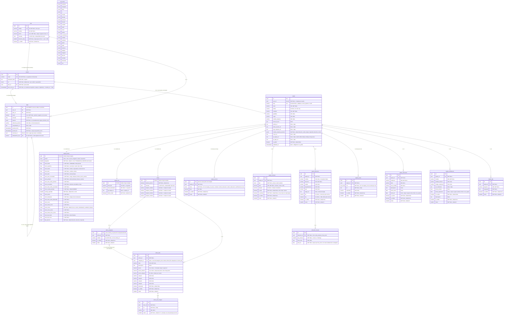

# Diagrama de la base de datos

Vista en Mermaid de `database.md`. La fuente de verdad es `database.md`: si
cambia, este diagrama se actualiza para que coincida.

```mermaid
erDiagram
	direction TB

	%% Todas las tablas tienen además, por BaseModel: created_at, created_by,
	%% updated_at, updated_by, is_deleted, deleted_at, deleted_by (soft delete).
	%% UK = único solo entre registros no eliminados.

	plan {
		uuid id PK ""
		varchar codigo UK "10, NOT NULL, free | pro"
		varchar nombre "60, NOT NULL"
		numeric precio "12,2, NOT NULL, mayor o igual a 0, free = 0"
		char moneda "3, NOT NULL, default BOB, ISO 4217"
		smallint duracion_dias "NOT NULL, mayor que 0, free = 7, pro = 365"
		boolean is_visible "NOT NULL, default true"
	}

	usuario {
		uuid id PK ""
		varchar email UK "255, NOT NULL, se guarda en minusculas"
		text password_hash "NOT NULL, argon2"
		enum rol "NOT NULL, default user, user | admin | superadmin"
		uuid plan_id FK "NOT NULL, plan actual"
		timestamptz plan_vence_at "NOT NULL, se recalcula al registrar un pago; al registrarse = created_at + 7 dias"
	}

	pago {
		uuid id PK "solo INSERT: nunca se edita ni se elimina"
		uuid user_id FK "NOT NULL"
		uuid plan_id FK "NOT NULL"
		numeric monto "12,2, NOT NULL, positivo; negativo si es reverso"
		char moneda "3, NOT NULL"
		enum metodo "NOT NULL, qr | transferencia | tarjeta | efectivo | otro"
		varchar referencia_externa "100, NULL, id de la transaccion"
		text comprobante_url "NULL, https"
		timestamptz periodo_inicio "NOT NULL"
		timestamptz periodo_fin "NOT NULL, mayor que periodo_inicio"
		uuid reverses_id FK,UK "NULL, pago que anula o reembolsa"
		varchar idempotency_key UK "64, NOT NULL, evita registrar dos veces"
	}

	tarjeta {
		uuid id PK ""
		uuid user_id FK,UK "NOT NULL, 1 tarjeta por usuario"
		varchar slug UK "80, NOT NULL, editable, a-z 0-9 y guiones, 3 a 80"
		varchar rubro "150, NOT NULL"
		varchar prefijo "30, NULL, Dr. Dra. Ing."
		varchar nombres "150, NOT NULL"
		varchar apellidos "150, NULL"
		varchar cargo "150, NULL"
		varchar nombre_empresa "200, NULL"
		text acerca_de_mi "NULL"
		text profile_url "NULL, https"
		text photo_usuario_url "NULL, https"
		text logo_empresa_url "NULL, https"
		enum nombre_empresa_posicion "NOT NULL, default derecha, arriba | abajo | izquierda | derecha | oculto"
		text cover_url "NULL, https"
		text qr_tarjeta_url "NULL, https, el QR codifica /t/{id} y redirige al slug actual"
		text qr_pago_url "NULL, https"
		boolean is_public "NOT NULL, default false"
		timestamptz published_at "NULL, obligatorio si is_public"
	}

	tarjeta_theme {
		uuid id PK,FK "mismo id que la tarjeta"
		enum preset "NULL, claro | oscuro | elegante | salud | corporativo"
		smallint tipografia "NOT NULL, default 1, id en TIPOGRAFIAS_TARJETA del frontend"
		char color_fondo "7, NOT NULL, #RRGGBB, fondo general"
		char color_superficie "7, NOT NULL, secciones, cards, items, FAQ"
		char color_borde "7, NOT NULL, bordes, separadores, borde de foto"
		char color_titulo "7, NOT NULL, nombre y titulos"
		char color_texto "7, NOT NULL, texto principal"
		char color_texto_secundario "7, NOT NULL, cargo, empresa, fechas, precio_anterior"
		char color_primario "7, NOT NULL, boton principal, enlaces, acentos"
		char color_texto_sobre_primario "7, NOT NULL"
		char color_secundario "7, NOT NULL, botones secundarios, chips"
		char color_texto_sobre_secundario "7, NOT NULL"
		char color_overlay_portada "7, NOT NULL, default #000000"
		smallint overlay_opacidad "NOT NULL, default 40, 0 a 100"
		char color_precio "7, NOT NULL"
		char color_destacado "7, NOT NULL, badge de item destacado"
		char color_texto_sobre_destacado "7, NOT NULL"
		char color_icono "7, NOT NULL"
		char color_fondo_icono "7, NOT NULL"
		enum icono_forma "NOT NULL, default circulo, circulo | redondeado | cuadrado | ninguno"
		char color_icono_social "7, NOT NULL"
		char color_fondo_icono_social "7, NOT NULL"
		char color_fab_fondo "7, NOT NULL, boton flotante"
		char color_fab_icono "7, NOT NULL"
		enum fab_posicion "NOT NULL, default derecha, derecha | izquierda"
	}

	tarjeta_seo {
		uuid id PK,FK "mismo id que la tarjeta"
		varchar meta_title "70, NULL = se genera"
		varchar meta_description "160, NULL = se genera"
		text og_image_url "NULL = profile_url"
		boolean robots_index "NOT NULL, default true"
	}

	tarjeta_seccion {
		uuid id PK "las 8 se crean junto con la tarjeta"
		uuid tarjeta_id FK "NOT NULL"
		enum clave "NOT NULL, UK con tarjeta_id, acerca | contacto | vitrina | ubicacion | redes | educacion | certificaciones | faq"
		varchar titulo "80, NULL"
		boolean is_visible "NOT NULL, default true"
		smallint orden "NOT NULL, default 0"
	}

	tarjeta_contacto {
		uuid id PK ""
		uuid tarjeta_id FK "NOT NULL"
		enum tipo "NOT NULL, phone | email | website"
		varchar valor "255, NOT NULL, numero, correo o URL"
		varchar etiqueta "60, NULL, Celular, Consultorio"
		boolean is_wpp "NOT NULL, default false, solo si tipo = phone"
		boolean is_primary "NOT NULL, default false, uno por tipo en cada tarjeta"
		boolean is_visible "NOT NULL, default true"
		smallint orden "NOT NULL, default 0"
	}

	tarjeta_ubicacion {
		uuid id PK ""
		uuid tarjeta_id FK "NOT NULL"
		varchar nombre "150, NULL, Consultorio Norte"
		varchar direccion "255, NOT NULL"
		varchar ciudad "100, NULL"
		varchar departamento "100, NULL"
		varchar pais "100, NULL"
		text maps_url "NULL, ficha de Google"
		numeric lat "9,6, NULL, -90 a 90, junto con lng"
		numeric lng "9,6, NULL, -180 a 180, junto con lat"
		boolean is_visible "NOT NULL, default true"
		smallint orden "NOT NULL, default 0"
	}

	ubicacion_horario {
		uuid id PK ""
		uuid ubicacion_id FK "NOT NULL, UK con dia_semana y hora_inicio"
		smallint dia_semana "NOT NULL, 1 lunes a 7 domingo"
		time hora_inicio "NOT NULL"
		time hora_fin "NOT NULL, mayor que hora_inicio; sin cruzar medianoche ni solaparse"
	}

	red_social {
		enum facebook ""
		enum instagram ""
		enum tiktok ""
		enum x ""
		enum threads ""
		enum bluesky ""
		enum pinterest ""
		enum linkedin ""
		enum youtube ""
		enum twitch ""
		enum vimeo ""
		enum spotify ""
		enum soundcloud ""
		enum medium ""
		enum substack ""
		enum github ""
		enum gitlab ""
		enum behance ""
		enum dribbble ""
		enum telegram ""
		enum discord ""
		enum calendly ""
		enum doctoralia ""
		enum otro ""
	}

	tarjeta_social {
		uuid id PK ""
		uuid tarjeta_id FK "NOT NULL"
		red_social red "NOT NULL, UK con tarjeta_id, una cuenta por red"
		text url "NOT NULL, https"
		varchar username "100, NULL"
		boolean is_visible "NOT NULL, default true"
		smallint orden "NOT NULL, default 0"
	}

	vitrina {
		uuid id PK,FK "mismo id que la tarjeta"
		boolean mostrar_precios "NOT NULL, default true"
		char moneda "3, NOT NULL, default BOB, ISO 4217"
		varchar campo1_nombre "40, NULL = campo no usado"
		varchar campo2_nombre "40, NULL = campo no usado"
		varchar campo3_nombre "40, NULL = campo no usado"
		varchar campo4_nombre "40, NULL = campo no usado"
	}

	vitrina_categoria {
		uuid id PK "UK con vitrina_id, para la FK compuesta del item"
		uuid vitrina_id FK "NOT NULL"
		varchar nombre "60, NOT NULL, UK con vitrina_id"
		boolean is_visible "NOT NULL, default true"
		smallint orden "NOT NULL, default 0"
	}

	vitrina_item {
		uuid id PK ""
		uuid vitrina_id FK "NOT NULL"
		uuid categoria_id FK "NULL, una sola categoria y de la misma vitrina (FK compuesta con vitrina_id)"
		varchar titulo "150, NOT NULL"
		text descripcion "NULL"
		numeric precio "12,2, NULL = Consultar, mayor o igual a 0"
		numeric precio_anterior "12,2, NULL, mayor que precio, solo si hay precio"
		varchar precio_etiqueta "50, NULL, Desde, por sesion"
		varchar campo1 "100, NULL"
		varchar campo2 "100, NULL"
		varchar campo3 "100, NULL"
		varchar campo4 "100, NULL"
		boolean destacado "NOT NULL, default false"
		boolean is_visible "NOT NULL, default true"
		smallint orden "NOT NULL, default 0"
	}

	vitrina_item_imagen {
		uuid id PK ""
		uuid item_id FK "NOT NULL"
		text url "NOT NULL, https"
		varchar alt "150, NULL"
		smallint orden "NOT NULL, default 0, 0 = principal, una sola principal por item"
	}

	tarjeta_educacion {
		uuid id PK ""
		uuid tarjeta_id FK "NOT NULL"
		varchar institucion "200, NOT NULL"
		varchar titulo "200, NULL"
		varchar area_estudio "200, NULL"
		text descripcion "NULL"
		date fecha_inicio "NULL"
		date fecha_fin "NULL, mayor o igual a inicio, NULL si is_actual"
		boolean is_actual "NOT NULL, default false"
		boolean is_visible "NOT NULL, default true"
		smallint orden "NOT NULL, default 0"
	}

	tarjeta_certificacion {
		uuid id PK ""
		uuid tarjeta_id FK "NOT NULL"
		varchar nombre "200, NOT NULL"
		varchar entidad_emisora "200, NULL"
		varchar codigo_credencial "150, NULL"
		text url_credencial "NULL, https"
		date fecha_emision "NULL"
		date fecha_expiracion "NULL, mayor o igual a emision, NULL si no_expira"
		boolean no_expira "NOT NULL, default false"
		text descripcion "NULL"
		boolean is_visible "NOT NULL, default true"
		smallint orden "NOT NULL, default 0"
	}

	tarjeta_faq {
		uuid id PK ""
		uuid tarjeta_id FK "NOT NULL"
		varchar pregunta "300, NOT NULL"
		text respuesta "NOT NULL"
		boolean is_visible "NOT NULL, default true"
		smallint orden "NOT NULL, default 0"
	}

	plan||--o{usuario:"1 a N (plan actual del usuario)"
	usuario||--o{pago:"1 a N (historial de pagos)"
	plan||--o{pago:"1 a N"
	pago|o--o|pago:"0..1 a 0..1 (un reverso anula un pago)"
	usuario||--o|tarjeta:"1 a 0..1 (un usuario, una tarjeta)"
	tarjeta||--||tarjeta_theme:"1 a 1 (mismo id)"
	tarjeta||--||tarjeta_seo:"1 a 1 (mismo id)"
	tarjeta||--||vitrina:"1 a 1 (mismo id)"
	tarjeta||--|{tarjeta_seccion:"1 a 8 (una por clave)"
	tarjeta||--o{tarjeta_contacto:"1 a N"
	tarjeta||--o{tarjeta_ubicacion:"1 a N"
	tarjeta_ubicacion||--o{ubicacion_horario:"1 a N"
	tarjeta||--o{tarjeta_social:"1 a N (una por red)"
	vitrina||--o{vitrina_categoria:"1 a N"
	vitrina||--o{vitrina_item:"1 a N"
	vitrina_item||--o{vitrina_item_imagen:"1 a N"
	tarjeta||--o{tarjeta_educacion:"1 a N"
	tarjeta||--o{tarjeta_certificacion:"1 a N"
	tarjeta||--o{tarjeta_faq:"1 a N"
	vitrina_categoria|o--o{vitrina_item:"0..1 a N (el item puede tener una categoria)"
```
